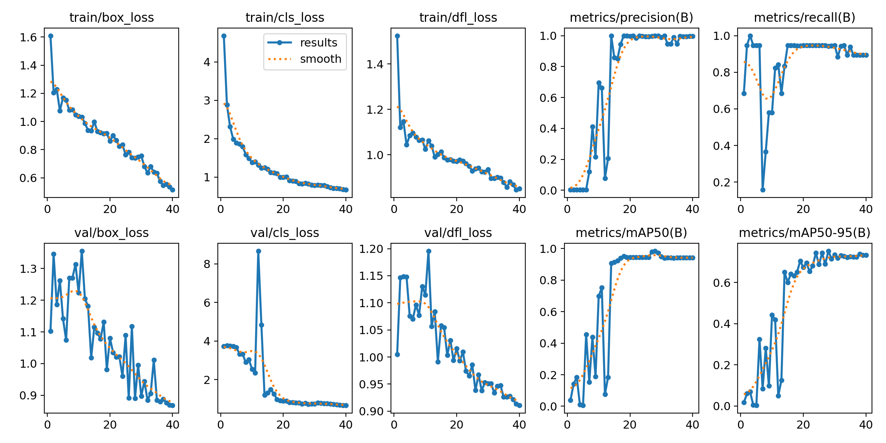

# Práctica 4: Reconocimiento de matrículas.

## Descripción

El objetivo de esta práctica es conseguir mediante el modelo de detección de objeto YOLO (_You Only Look Once_) una detección de matrículas españolas. Para ello, ha sido necesario entrenar un modelo, utilizando un dataset de imágenes extraido de [Roboflow](https://universe.roboflow.com/).

## Tareas del proyecto.

### Detección de personas y vehículos.

Para realizar este apartado utilizamos el modelo ya proporcionado por la librería YOLO (_yolo11n.pt_), teniendo únicamente que cargar dicho modelo y posteriormente realizar el seguimiente en el vídeo con la función track.

### Detección y lectura de matrículas.

Para este apartado es necesario entrenar un modelo nuevo que se especialice en la detección de matriculas con el dataset mencionado en la descripción. Para entrenar al modelo será necesario ejecutar la siguiente orden en la consola de anaconda:

  - Con CPU:
  ```
  yolo detect train model=yolo11n.pt data=dataset/data.yaml imgsz=416 batch=4 device=CPU epochs=40
  ```
  
  - Con GPU:
  ```
  yolo detect train model=yolo11n.pt data=dataset/miarchivo.yml imgsz=416 batch=4 device=0 epochs=40
  ```

Posteriormente se realiza la detección de matrículas cada vez que se detecte un vehículo y se utiliza el OCR (Optical Character Recognition) de pytesseract para leer la matrícula.

- Conteo de cada clase.

Para realizar esta tarea se hace uso de un diccionario en el que se irá almacenando las diferentes clases detectadas en el video y el número de apariciones de la misma.

- Volcar a disco los resultados.

Se realiza mediante las funciones de cv2 para codificar video (en MP4 en este caso) y guardar video (VideoWriter).

- Generar archivo CSV.

Se utiliza la librería csv para poder generar y actualizar, frame a frame, el archivo pedido. Se utilizan las columnas recomendadas para esta práctica, es decir:

```
fotograma, tipo_objeto, confianza, identificador_tracking, x1, y1, x2, y2, matrícula_en_su_caso, confianza, mx1,my1,mx2,my2, texto_matricula
```

Como añadido final, se ha encontrado problemas con el OCR al no detectar correctamente las matrículas. Se ha tratado de realizar preprocesado de imagen o el OCR de EasyOCR, pero hemos obtenido peores resultados y decidimos dejarlo como estaba.

## Entrenamiento


Estas gráficas representan las métricas de entrenamiento y validación:

1. **entrenamiento/pérdida_de_caja**: La pérdida de cajas durante el entrenamiento muestra una tendencia decreciente constante que demuestra que el modelo va mejorando en la colocación de las cajas alrededor de los objetos.

2. **train/cls_loss**: La pérdida de clasificación durante el entrenamiento también decrece rápidamente al inicio y luego se estabiliza, sugiriendo que el modelo está aprendiendo a clasificar correctamente los objetos.

3. **train/dfl_loss**: Disminuye durante el entrenamiento, indicando que el modelo mejora en la clasificación precisa de la ubicación dentro de cada caja, permitiendo una mejor localización de objetos en grano fino.

4. **métricas/precisión(B)**: La precisión del modelo mejora significativamente y se mantiene en niveles altos, lo que indica que la tasa de falsas predicciones es bastante baja.

5. **métricas/exhaustividad(B)**: La puntuación recall aumenta rápidamente e incluso tiende a establecerse un poco por debajo de 1, lo que confirma que la mayoría de los objetos presentes son detectados por el modo (su tasa de verdaderos positivos es alta).

6. **val/pérdida_de_caja**: La pérdida de la casilla de validación es más ruidosa, aunque tiende a disminuir en general, lo que demuestra que las casillas del conjunto de validación están mejor ajustadas que el anterior.

8. **val/dfl_loss**: También baja en validación, aunque de forma menos estable, sugiriendo que el modelo mantiene un ajuste razonable en la clasificación de detalles finos en el conjunto de validación.

9. **metría/mAP50(B)**: El mAP en IoU 0,5 aumenta bruscamente y luego se estabiliza aproximadamente en 1, lo que indica que el modelo ha alcanzado su fase prima.


## Demostración


## Requisitos
### [Anaconda Prompt](https://www.anaconda.com/)
```
conda create --name VC_P4 python=3.9.5
conda activate VC_P4
```
### OpenCV
```
pip install opencv-python
```
### Ultralytics (YOLO)
```
pip install ultralytics
```
### Lapx
```
pip install lapx
```
### Pytorch y CUDA (En el caso de contar con GPU).
```
pip install torch torchvision torchaudio --index-url https://download.pytorch.org/whl/cu124
```
### Pytesseract
```
pip install pytesseract
```

## Bibliografía
[Modelo utilizado para el entrenamiento.](https://universe.roboflow.com/licenseplates-h9qfr/spanish-license-plates)

[Ultralytics Docs.](https://docs.ultralytics.com/)

## Autoría
[Sara Expósito Suárez](https://github.com/SaraE5)

[Alejandro Padrón Ossorio](https://github.com/apadoss)
